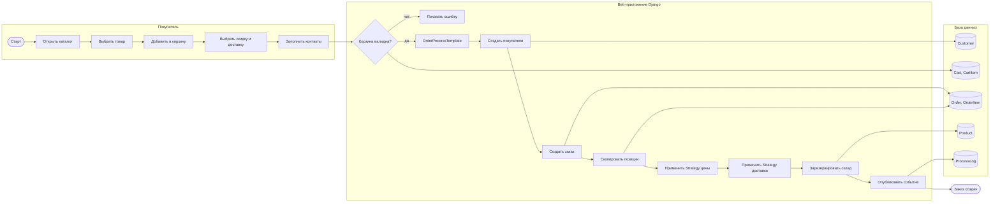
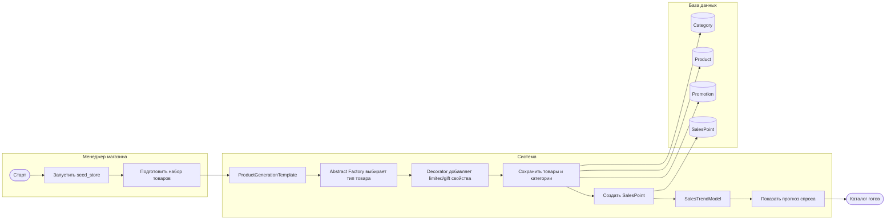

# BPMN

Диаграммы даны в Mermaid-формате, чтобы их можно было открыть в редакторе Markdown с поддержкой Mermaid.

## Бизнес-процесс 1: покупка товара

## Бизнес-процесс 2: пополнение каталога и аналитика спроса

