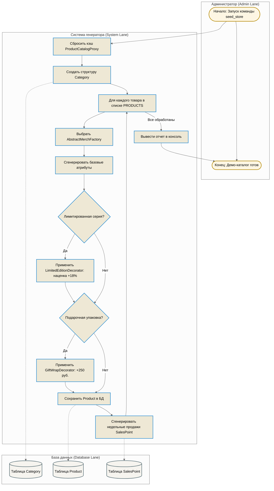

# Схемы бизнес-процессов (BPMN)

В системе реализовано 2 основных бизнес-процесса (БП), спроектированных в соответствии с нотацией BPMN и полностью отражающих работу с базой данных:
1. **БП «Оформление заказа»** (интегрирован с паттерном *Шаблонный метод* и *Состояния*).
2. **БП «Импорт и генерация демо-каталога»** (интегрирован с паттернами *Шаблонный метод*, *Абстрактная Фабрика* и *Декоратор*).

---

## 1. БП «Оформление заказа»

### Описание процесса:
Процесс запускается, когда покупатель отправляет заполненную форму корзины. Система выполняет транзакционную проверку, сохраняет информацию о покупателе, создает заказ в статусе `CREATED`, резервирует остатки товара на складе, применяет стратегии расчета цен и доставки, после чего отправляет уведомления через шину событий.

### BPMN-схема процесса на Mermaid:

---

## 2. БП «Импорт и генерация демо-каталога»

### Описание процесса:
Процесс запускается администратором через консольную команду `python manage.py seed_store`. Он считывает массив демо-данных, последовательно определяет фабрику для каждой категории мерча, при необходимости декорирует данные (лимитированная серия, подарочная упаковка), создает или обновляет записи в БД, а также рассчитывает историю продаж для аналитической математической модели.

### BPMN-схема процесса на Mermaid:

