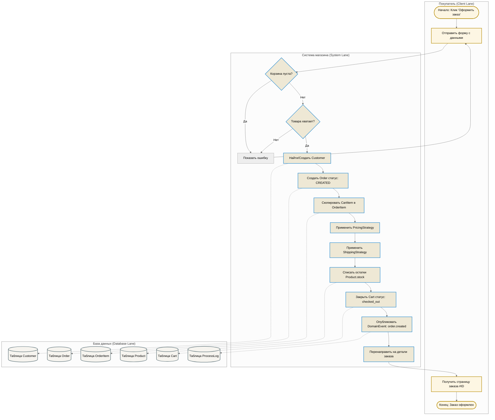
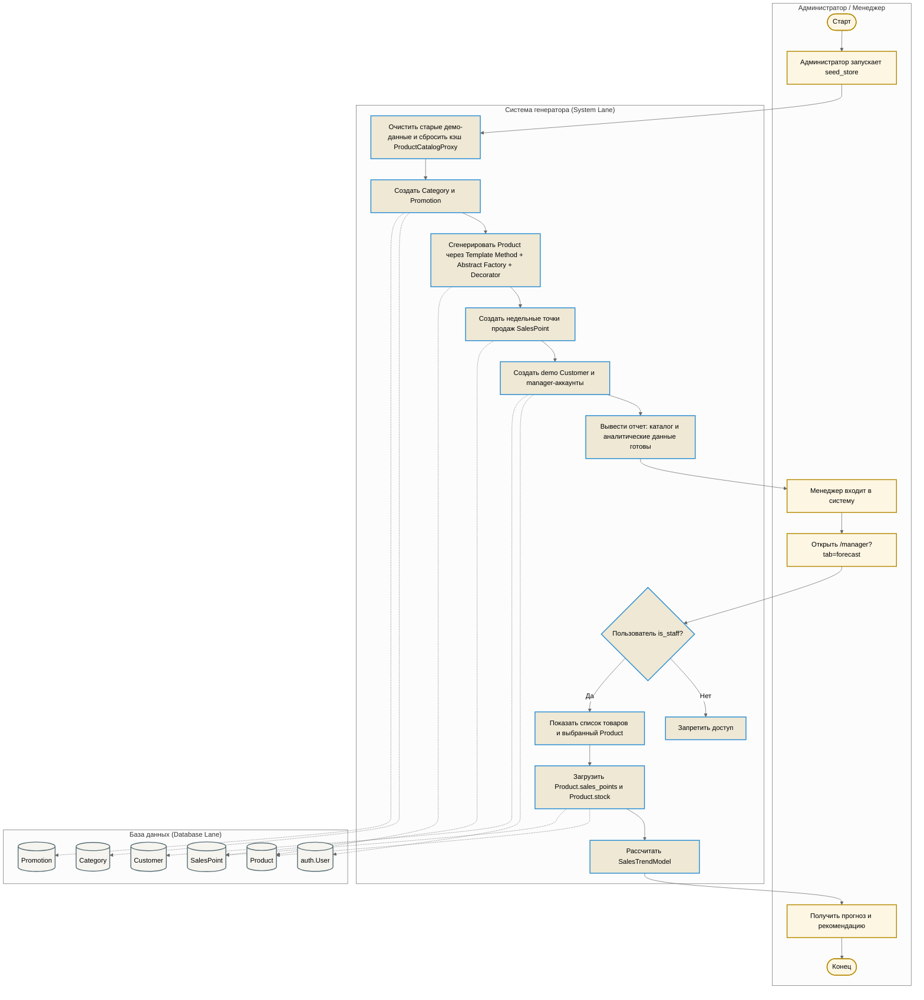

# Схемы бизнес-процессов (BPMN)

В системе реализовано 2 основных бизнес-процесса (БП), спроектированных в соответствии с нотацией BPMN и полностью отражающих работу с базой данных:
1. **БП «Оформление заказа»** (интегрирован с паттерном *Шаблонный метод* и *Состояния*).
2. **БП «Импорт и генерация демо-каталога»** (интегрирован с паттернами *Шаблонный метод*, *Абстрактная Фабрика* и *Декоратор*).

---

## 1. БП «Оформление заказа»

### Описание процесса:
Процесс запускается, когда покупатель отправляет заполненную форму корзины. Система выполняет транзакционную проверку, сохраняет информацию о покупателе, создает заказ в статусе `CREATED`, резервирует остатки товара на складе, применяет стратегии расчета цен и доставки, после чего отправляет уведомления через шину событий.

### BPMN-схема процесса на Mermaid:

---

## 2. БП «Пополнение каталога и аналитика спроса»

### Описание процесса:
Процесс состоит из двух связанных частей. Сначала администратор подготавливает демонстрационный каталог через консольную команду `python manage.py seed_store`: система очищает старые записи, пересобирает категории, товары, промоакции и точки продаж. Затем менеджер входит в веб-интерфейс, открывает вкладку прогноза спроса, выбирает товар и получает расчет от `SalesTrendModel` на основе `SalesPoint` и текущего остатка `Product.stock`.

### BPMN-схема процесса на Mermaid:

