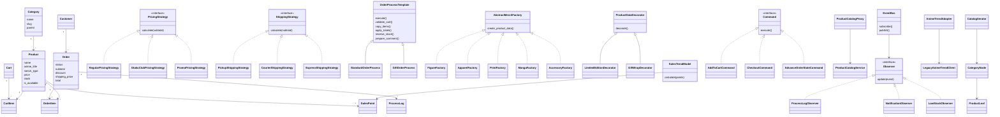

# Финальная диаграмма классов

```mermaid
classDiagram
    class Category {
        name
        slug
        parent
    }
    class Product {
        name
        anime_title
        merch_type
        price
        stock
        is_available
    }
    class Cart
    class CartItem
    class Customer
    class Order {
        status
        subtotal
        discount
        shipping_price
        total
    }
    class OrderItem
    class SalesPoint
    class ProcessLog

    Category "1" --> "*" Product
    Cart "1" --> "*" CartItem
    Product "1" --> "*" CartItem
    Customer "1" --> "*" Order
    Order "1" --> "*" OrderItem
    Product "1" --> "*" OrderItem
    Product "1" --> "*" SalesPoint
    Order "1" --> "*" ProcessLog

    class PricingStrategy {
        <<interface>>
        calculate(subtotal)
    }
    class RegularPricingStrategy
    class OtakuClubPricingStrategy
    class PromoPricingStrategy
    PricingStrategy <|.. RegularPricingStrategy
    PricingStrategy <|.. OtakuClubPricingStrategy
    PricingStrategy <|.. PromoPricingStrategy

    class ShippingStrategy {
        <<interface>>
        calculate(subtotal)
    }
    class PickupShippingStrategy
    class CourierShippingStrategy
    class ExpressShippingStrategy
    ShippingStrategy <|.. PickupShippingStrategy
    ShippingStrategy <|.. CourierShippingStrategy
    ShippingStrategy <|.. ExpressShippingStrategy

    class OrderProcessTemplate {
        execute()
        validate_cart()
        copy_items()
        apply_totals()
        reserve_stock()
        prepare_comment()
    }
    class StandardOrderProcess
    class GiftOrderProcess
    OrderProcessTemplate <|-- StandardOrderProcess
    OrderProcessTemplate <|-- GiftOrderProcess

    class AbstractMerchFactory {
        create_product_data()
    }
    class FigureFactory
    class ApparelFactory
    class PrintFactory
    class MangaFactory
    class AccessoryFactory
    AbstractMerchFactory <|.. FigureFactory
    AbstractMerchFactory <|.. ApparelFactory
    AbstractMerchFactory <|.. PrintFactory
    AbstractMerchFactory <|.. MangaFactory
    AbstractMerchFactory <|.. AccessoryFactory

    class ProductDataDecorator {
        decorate()
    }
    class LimitedEditionDecorator
    class GiftWrapDecorator
    ProductDataDecorator <|-- LimitedEditionDecorator
    ProductDataDecorator <|-- GiftWrapDecorator

    class EventBus {
        subscribe()
        publish()
    }
    class Observer {
        <<interface>>
        update(event)
    }
    class ProcessLogObserver
    class NotificationObserver
    class LowStockObserver
    Observer <|.. ProcessLogObserver
    Observer <|.. NotificationObserver
    Observer <|.. LowStockObserver
    EventBus --> Observer

    class Command {
        <<interface>>
        execute()
    }
    class AddToCartCommand
    class CheckoutCommand
    class AdvanceOrderStateCommand
    Command <|.. AddToCartCommand
    Command <|.. CheckoutCommand
    Command <|.. AdvanceOrderStateCommand

    class ProductCatalogProxy
    class ProductCatalogService
    ProductCatalogProxy --> ProductCatalogService

    class CategoryNode
    class ProductLeaf
    class CatalogIterator
    CategoryNode --> ProductLeaf
    CatalogIterator --> CategoryNode

    class AnimeTrendAdapter
    class LegacyAnimeTrendClient
    AnimeTrendAdapter --> LegacyAnimeTrendClient

    class SalesTrendModel {
        calculate(points)
    }
    SalesTrendModel --> SalesPoint
```
