# Архитектурная диаграмма классов (UML Class Diagram)

В данном документе приведена финальная UML-диаграмма классов системы **«Anime Shelf»**, отображающая взаимосвязи между всеми **13 реализованными паттернами проектирования** (с учетом новых паттернов **Фабричный метод** и **Отмена команды (Undo)**) и основными сущностями.

---

## Диаграмма классов на Mermaid

```mermaid
classDiagram
    %% --- ПАТТЕРН FACADE (ФАСАД) ---
    class StoreFacade {
        <<Singleton>>
        +get_open_cart(request) Cart
        +get_cart_totals(cart, pricing, shipping) dict
        +list_products(category_slug, query, limit) list
        +get_product_detail(slug) dict
        +get_top_trend_product_and_trend() dict
        +add_to_cart(request, slug, quantity) Cart
        +update_cart_item(request, item_id, quantity) Cart
        +remove_cart_item(request, item_id) Cart
        +undo_last_action(request) boolean
        +has_command_history(request) boolean
        +get_all_orders() list
        +get_all_logs() list
        +get_all_products_trends() list
        +checkout_cart(request, form_data) Order
        +get_order_detail(pk) dict
        +advance_order_state(order_id, action) Order
        +get_catalog_tree_and_flat() dict
        +get_patterns_demo_data() dict
    }
    
    %% --- ПАТТЕРН SINGLETON (СИНГЛТОН) ---
    class StoreSettings {
        <<Singleton>>
        +brand_name : string
        +free_shipping_threshold : Decimal
        +otaku_club_discount : Decimal
        +premium_packaging_price : Decimal
        +low_stock_threshold : int
        +money(value) Decimal
    }
    
    %% --- ПАТТЕРН PROXY (ЗАМЕСТИТЕЛЬ) ---
    class ProductCatalogService {
        +list_products(category_slug, query) list
    }
    class ProductCatalogProxy {
        -service : ProductCatalogService
        -_cache : dict
        +list_products(category_slug, query) list
        +clear_cache()$
    }
    ProductCatalogProxy --> ProductCatalogService : "delegates to"
    StoreFacade --> ProductCatalogProxy : "uses"

    %% --- ПАТТЕРН ADAPTER (АДАПТЕР) ---
    class LegacyAnimeTrendClient {
        +load_hot_titles() list
    }
    class AnimeTrendAdapter {
        -client : LegacyAnimeTrendClient
        +recommended_products(limit) list
        +labels() list
    }
    AnimeTrendAdapter --> LegacyAnimeTrendClient : "adapts"
    StoreFacade --> AnimeTrendAdapter : "uses"

    %% --- ПАТТЕРНЫ COMPOSITE (КОМПОНОВЩИК) И ITERATOR (ИТЕРАТОР) ---
    class CatalogComponent {
        <<Interface>>
        +kind : string
        +render_label()* string
        +iter_items() Generator
    }
    class ProductLeaf {
        +product : Product
        +level : int
        +render_label() string
    }
    class CategoryNode {
        +category : Category
        +level : int
        +children : list~CatalogComponent~
        +add(component)
        +render_label() string
        +iter_items() Generator
    }
    class CatalogIterator {
        -_items : list~CatalogComponent~
        -_index : int
        +__iter__() CatalogIterator
        +__next__() CatalogComponent
    }
    CatalogComponent <|-- ProductLeaf : "implements"
    CatalogComponent <|-- CategoryNode : "implements"
    CategoryNode *-- CatalogComponent : "contains"
    CatalogIterator --> CatalogComponent : "traverses"
    StoreFacade --> CatalogIterator : "uses"

    %% --- ПАТТЕРН STRATEGY (СТРАТЕГИЯ) ---
    class PricingStrategy {
        <<Interface>>
        +code : string
        +label : string
        +calculate(subtotal)* PriceBreakdown
    }
    class RegularPricingStrategy {
        +calculate(subtotal) PriceBreakdown
    }
    class OtakuClubPricingStrategy {
        +calculate(subtotal) PriceBreakdown
    }
    class PromoPricingStrategy {
        +calculate(subtotal) PriceBreakdown
    }
    PricingStrategy <|-- RegularPricingStrategy
    PricingStrategy <|-- OtakuClubPricingStrategy
    PricingStrategy <|-- PromoPricingStrategy

    class ShippingStrategy {
        <<Interface>>
        +code : string
        +label : string
        +days : string
        +calculate(subtotal)* ShippingBreakdown
    }
    class PickupShippingStrategy {
        +calculate(subtotal) ShippingBreakdown
    }
    class CourierShippingStrategy {
        +calculate(subtotal) ShippingBreakdown
    }
    class ExpressShippingStrategy {
        +calculate(subtotal) ShippingBreakdown
    }
    ShippingStrategy <|-- PickupShippingStrategy
    ShippingStrategy <|-- CourierShippingStrategy
    ShippingStrategy <|-- ExpressShippingStrategy

    StoreFacade --> PricingStrategy : "selects & executes"
    StoreFacade --> ShippingStrategy : "selects & executes"

    %% --- ПАТТЕРН TEMPLATE METHOD (ШАБЛОННЫЙ МЕТОД) ---
    class OrderProcessTemplate {
        <<Abstract>>
        +execute(cart, customer_data, pricing, shipping, comment) Order
        +validate_cart(cart)
        +resolve_customer(data) Customer
        +create_order(customer, pricing, shipping, comment) Order
        +copy_items(cart, order)
        +apply_totals(order, pricing, shipping)
        +reserve_stock(order)
        +close_cart(cart)
        +after_success(order)
        +prepare_comment(comment)* string
    }
    class StandardOrderProcess {
        +prepare_comment(comment) string
    }
    class GiftOrderProcess {
        +prepare_comment(comment) string
    }
    OrderProcessTemplate <|-- StandardOrderProcess
    OrderProcessTemplate <|-- GiftOrderProcess

    class ProductGenerationTemplate {
        <<Abstract>>
        +generate(rows, category_resolver) list
        +select_factory(row) AbstractMerchFactory
        +decorate_payload(row, payload) dict
        +persist(row, payload, category) Product
    }
    class DemoCatalogGenerationTemplate {
        +decorate_payload(row, payload) dict
    }
    ProductGenerationTemplate <|-- DemoCatalogGenerationTemplate

    %% --- ПАТТЕРНЫ ABSTRACT FACTORY (АБСТРАКТНАЯ ФАБРИКА), FACTORY METHOD (ФАБРИЧНЫЙ МЕТОД) И DECORATOR (ДЕКОРАТОР) ---
    class MerchFactoryProvider {
        +get_factory(merch_type)$ AbstractMerchFactory
    }
    class AbstractMerchFactory {
        <<Interface>>
        +merch_type : string
        +create_product_data(row)* dict
        +base_payload(row) dict
    }
    class FigureFactory { +create_product_data(row) dict }
    class ApparelFactory { +create_product_data(row) dict }
    class PrintFactory { +create_product_data(row) dict }
    class MangaFactory { +create_product_data(row) dict }
    class AccessoryFactory { +create_product_data(row) dict }
    AbstractMerchFactory <|-- FigureFactory
    AbstractMerchFactory <|-- ApparelFactory
    AbstractMerchFactory <|-- PrintFactory
    AbstractMerchFactory <|-- MangaFactory
    AbstractMerchFactory <|-- AccessoryFactory

    MerchFactoryProvider ..> AbstractMerchFactory : "creates (Factory Method)"

    class ProductDataDecorator {
        -payload : dict
        +decorate() dict
    }
    class LimitedEditionDecorator { +decorate() dict }
    class GiftWrapDecorator { +decorate() dict }
    ProductDataDecorator <|-- LimitedEditionDecorator
    ProductDataDecorator <|-- GiftWrapDecorator
    ProductDataDecorator --> ProductDataDecorator : "wraps (nested decoration)"

    ProductGenerationTemplate --> MerchFactoryProvider : "delegates creation"
    ProductGenerationTemplate --> ProductDataDecorator : "uses"

    %% --- ПАТТЕРНЫ COMMAND (КОМАНДА) И UNDO (ОТМЕНА) ---
    class Command {
        <<Interface>>
        +execute()* any
        +undo()
    }
    class AddToCartCommand { +execute() Cart, +undo() Cart }
    class UpdateCartItemCommand { +execute() Cart, +undo() Cart }
    class RemoveCartItemCommand { +execute() Cart, +undo() Cart }
    class CheckoutCommand { +execute() Order }
    class AdvanceOrderStateCommand { +execute() Order }
    Command <|-- AddToCartCommand
    Command <|-- UpdateCartItemCommand
    Command <|-- RemoveCartItemCommand
    Command <|-- CheckoutCommand
    Command <|-- AdvanceOrderStateCommand

    class CommandHistoryRegistry {
        <<Singleton>>
        -_history : dict
        +push(session_key, command)
        +pop(session_key) Command
        +has_history(session_key) boolean
    }

    StoreFacade --> Command : "instantiates & triggers"
    StoreFacade --> CommandHistoryRegistry : "tracks histories for Undo"
    CommandHistoryRegistry o-- Command : "holds"
    CheckoutCommand --> OrderProcessTemplate : "delegates checkout process"

    %% --- ПАТТЕРН OBSERVER (НАБЛЮДАТЕЛЬ) ---
    class DomainEvent {
        +event_type : string
        +message : string
        +order_id : int
        +level : string
        +payload : dict
    }
    class Observer {
        <<Interface>>
        +update(event)*
    }
    class EventBus {
        <<Singleton>>
        -_observers : dict
        +subscribe(event_type, observer)
        +publish(event)
    }
    class ProcessLogObserver { +update(event) }
    class LowStockObserver { +update(event) }
    class NotificationObserver { +update(event) }
    Observer <|-- ProcessLogObserver
    Observer <|-- LowStockObserver
    Observer <|-- NotificationObserver
    EventBus o-- Observer : "notifies"
    OrderProcessTemplate --> EventBus : "publishes order.created"
    
    %% --- ПАТТЕРН STATE (СОСТОЯНИЕ) ---
    class OrderState {
        <<Interface>>
        +status : string
        +transitions : tuple~Transition~
        +allowed_transitions() tuple
    }
    class CreatedState { +status, +transitions }
    class PaidState { +status, +transitions }
    class PackedState { +status, +transitions }
    class ShippedState { +status, +transitions }
    class DeliveredState { +status, +transitions }
    class CancelledState { +status, +transitions }
    OrderState <|-- CreatedState
    OrderState <|-- PaidState
    OrderState <|-- PackedState
    OrderState <|-- ShippedState
    OrderState <|-- DeliveredState
    OrderState <|-- CancelledState

    class OrderStateMachine {
        +states : dict~OrderState~
        +get_state(order) OrderState
        +allowed_transitions(order) list
        +apply(order, action) Order
    }
    OrderStateMachine *-- OrderState : "manages"
    AdvanceOrderStateCommand --> OrderStateMachine : "executes state change"
    OrderStateMachine --> EventBus : "publishes order.status_changed"
```

---

## Что изменилось в диаграмме классов

1.  **Паттерн Фабричный метод (Factory Method)**:
    *   Добавлен статический фабричный метод `MerchFactoryProvider.get_factory(merch_type)` для порождения конкретных фабрик (`AbstractMerchFactory`).
    *   `ProductGenerationTemplate` теперь запрашивает нужную фабрику через провайдер.

2.  **Паттерн Отмена команды (Undo)**:
    *   В интерфейс `Command` добавлен метод `undo()`.
    *   Команды модификации корзины (`AddToCartCommand`, `UpdateCartItemCommand`, `RemoveCartItemCommand`) теперь реализуют метод `undo()`, храня внутреннее состояние до выполнения транзакции.
    *   Внедрен класс-синглтон `CommandHistoryRegistry`, который хранит стек истории выполненных команд для каждой уникальной сессии.
    *   В `StoreFacade` добавлены методы `undo_last_action` и `has_command_history` для удобного доступа со стороны контроллеров.

3.  **Роль Менеджера (расширение Facade)**:
    *   В `StoreFacade` добавлены новые методы: `get_all_orders()`, `get_all_logs()` и `get_all_products_trends()` для агрегирования данных, отображаемых в панели управления менеджера.
