# Диаграмма сущностей и связей (ERD) базы данных

Ниже приведена полная Entity-Relationship Diagram (ERD) базы данных интернет-магазина **«Anime Shelf»**. Структура спроектирована на СУБД SQLite с использованием ORM Django.

---

## ERD-диаграмма на Mermaid

```mermaid
erDiagram
    Category ||--o{ Category : "parent (self-relation)"
    Category ||--o{ Product : "contains"
    Customer ||--o{ Order : "places"
    Cart ||--o{ CartItem : "contains"
    Product ||--o{ CartItem : "added_to"
    Order ||--o{ OrderItem : "contains"
    Product ||--o{ OrderItem : "ordered_as"
    Product ||--o{ Review : "reviewed"
    Product ||--o{ SalesPoint : "has_sales_history"
    Order ||--o{ ProcessLog : "triggers_logs"

    Category {
        int id PK
        string name "Название категории"
        string slug "Уникальный URL-slug"
        string description "Описание категории"
        int parent_id FK "Ссылка на родительскую категорию"
        datetime created_at
        datetime updated_at
    }

    Product {
        int id PK
        int category_id FK "Ссылка на Category"
        string name "Название товара"
        string slug "Уникальный URL-slug"
        string anime_title "Название аниме-тайтла"
        string merch_type "Тип мерча (figure, clothes, manga...)"
        string description "Детальное описание товара"
        decimal price "Цена товара"
        int stock "Количество на складе"
        decimal rating "Средний рейтинг"
        int popularity_score "Рейтинг популярности (0-100)"
        int sales_count "Общее число продаж"
        string image_url "Ссылка на изображение"
        boolean is_active "Активен ли товар в каталоге"
        datetime created_at
        datetime updated_at
    }

    Customer {
        int id PK
        string name "ФИО покупателя"
        string email "E-mail адрес"
        string phone "Номер телефона"
        string city "Город доставки"
        datetime created_at
        datetime updated_at
    }

    Cart {
        int id PK
        string session_key "Уникальный ключ сессии Django"
        string status "Статус корзины (open, checked_out)"
        datetime created_at
        datetime updated_at
    }

    CartItem {
        int id PK
        int cart_id FK "Ссылка на Cart"
        int product_id FK "Ссылка на Product"
        int quantity "Добавленное количество"
        datetime created_at
        datetime updated_at
    }

    Promotion {
        int id PK
        string name "Название промоакции"
        string code "Уникальный промокод"
        int discount_percent "Процент скидки"
        boolean is_active "Активна ли акция"
        datetime created_at
        datetime updated_at
    }

    Order {
        int id PK
        int customer_id FK "Ссылка на Customer"
        string status "Статус заказа (created, paid...)"
        string delivery_method "Код способа доставки (courier, pickup...)"
        string pricing_strategy "Код стратегии цен (regular, otaku...)"
        decimal subtotal "Сумма товаров без скидок"
        decimal discount "Размер скидки"
        decimal shipping_price "Стоимость доставки"
        decimal total "Итоговая сумма к оплате"
        string comment "Комментарий покупателя"
        datetime created_at
        datetime updated_at
    }

    OrderItem {
        int id PK
        int order_id FK "Ссылка на Order"
        int product_id FK "Ссылка на Product"
        string product_name "Название товара на момент покупки"
        decimal unit_price "Цена единицы на момент покупки"
        int quantity "Количество"
    }

    Review {
        int id PK
        int product_id FK "Ссылка на Product"
        string customer_name "Имя автора отзыва"
        int rating "Оценка товара (1-5)"
        string text "Текст отзыва"
        datetime created_at
        datetime updated_at
    }

    SalesPoint {
        int id PK
        int product_id FK "Ссылка на Product"
        int week_number "Порядковый номер недели продаж"
        int units_sold "Количество проданных единиц"
        datetime created_at
        datetime updated_at
    }

    ProcessLog {
        int id PK
        int order_id FK "Ссылка на Order (опционально)"
        string event_type "Код события (order.created, stock.low...)"
        string level "Уровень события (info, warning, error)"
        string message "Текстовое описание события"
        datetime created_at
    }
```

---

## Описание связей
*   **Категории (Category)** связаны рекурсивным отношением `1:N` («родитель — потомки»), что позволяет строить вложенность категорий неограниченной глубины.
*   **Товары (Product)** жестко привязаны к категориям через отношение `1:N` (один товар принадлежит одной категории, в категории может быть много товаров).
*   **Корзина (Cart)** и **Заказ (Order)** привязаны к своим позициям (`CartItem` и `OrderItem`) отношением `1:N`, обеспечивая независимость данных: при изменении цены товара в каталоге цена в уже оформленных заказах (`OrderItem.unit_price`) остается неизменной.
*   **История продаж (SalesPoint)** используется математической моделью спроса и предложения. В таблице действует ограничение уникальности `UniqueConstraint(fields=["product", "week_number"])`.
*   **Журнал процесса (ProcessLog)** агрегирует системные события. Он может быть связан с конкретным заказом (`Order`), а может быть независимым системным событием.
