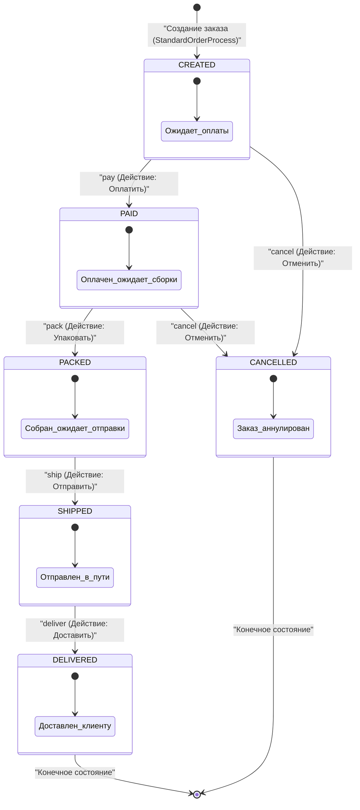

# Машина состояний заказа (State Machine)

Жизненный цикл заказа в системе реализован с использованием классического поведенческого паттерна **Состояние (State)**. Класс `OrderStateMachine` координирует переходы и обеспечивает строгую бизнес-логику движения заказа по статусам.

---

## Диаграмма переходов состояний на Mermaid

---

## Описание состояний и переходов

Машина состояний гарантирует, что заказ не может перепрыгнуть через статусы (например, быть отправленным до сборки или оплаты) и защищает бизнес-логику от некорректных действий.

| Текущий статус | Допустимое действие (Action) | Целевой статус | Результат действия |
|---|---|---|---|
| **CREATED** (Создан) | `pay` | **PAID** | Заказ оплачен покупателем, готов к сборке на складе. |
| **CREATED** (Создан) | `cancel` | **CANCELLED** | Заказ отменен до оплаты (остатки возвращаются на склад). |
| **PAID** (Оплачен) | `pack` | **PACKED** | Менеджер собрал и упаковал посылку. |
| **PAID** (Оплачен) | `cancel` | **CANCELLED** | Заказ отменен после оплаты (оформляется возврат средств). |
| **PACKED** (Упакован) | `ship` | **SHIPPED** | Передан службе доставки / курьеру. |
| **SHIPPED** (Отправлен) | `deliver` | **DELIVERED** | Успешно получен покупателем (конечное состояние). |
| **DELIVERED** (Доставлен)| — | — | Переходы отсутствуют. Заказ завершен. |
| **CANCELLED** (Отменен) | — | — | Переходы отсутствуют. Заказ аннулирован. |

---

## Интеграция с Наблюдателем (Observer)
Каждый успешный переход по статусу генерирует событие `order.status_changed`, которое рассылается через `EventBus`. 
Наблюдатель `NotificationObserver` перехватывает это событие и делает запись в `ProcessLog` о фиктивной отправке письма/СМС клиенту (например: *"Заказ №5: Создан -> Оплачен"*). Это позволяет легко расширять систему (например, подключить реальный SMS-шлюз или Telegram-бота просто добавив новый класс-наблюдатель).
