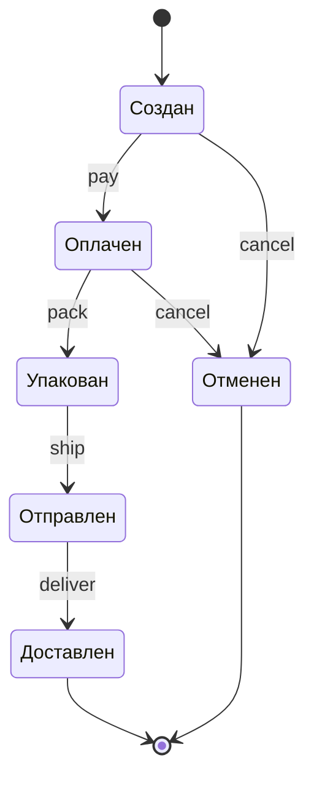

# Диаграмма машины состояний заказа

```mermaid
stateDiagram-v2
    [*] --> Created
    Created --> Paid: pay
    Created --> Cancelled: cancel
    Paid --> Packed: pack
    Paid --> Cancelled: cancel
    Packed --> Shipped: ship
    Shipped --> Delivered: deliver
    Delivered --> [*]
    Cancelled --> [*]

    Created: Создан
    Paid: Оплачен
    Packed: Упакован
    Shipped: Отправлен
    Delivered: Доставлен
    Cancelled: Отменен
```

Реализация: `store/services/states.py`, класс `OrderStateMachine`. Смена состояния запускается командой `AdvanceOrderStateCommand`.
