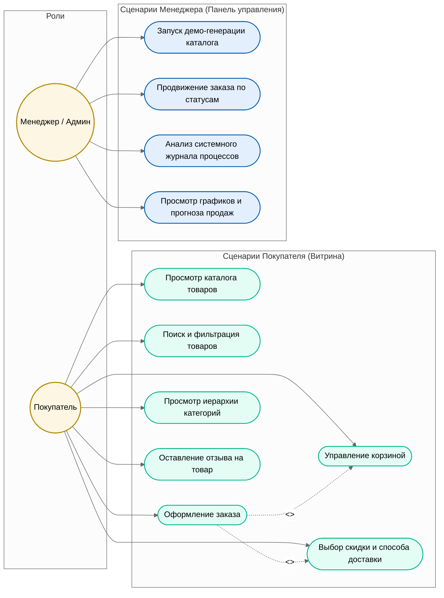

# Диаграмма прецедентов использования (Use Case Diagram)

Ниже представлена диаграмма сценариев использования (Use Case Diagram) для веб-приложения **«Anime Shelf»**, разработанная для Этапа 5 ТЗ. Схема разделяет роли обычного **Покупателя** и **Менеджера/Администратора** магазина.

---

## Use Case диаграмма на Mermaid

---

## Описание сценариев использования

### 1. Роль: Покупатель (Customer)
*   **Просмотр каталога товаров**: Получение списка всех доступных активных товаров на главной странице. Сценарий ускорен за счет использования кэширующего заместителя (`ProductCatalogProxy`).
*   **Поиск и фильтрация товаров**: Фильтрация товаров по текстовому запросу или по конкретной категории (включая дочерние категории).
*   **Управление корзиной**: Добавление товаров в корзину, изменение количества и удаление позиций. Каждое действие выполняется через выделенный класс команды (`Command`).
*   **Выбор скидки и способа доставки**: Интерактивный расчет стоимости корзины с выбором различных дисконтных карт (клуб отаку, сезонная промоакция) и способов доставки (самовывоз, курьер, экспресс), основанный на паттерне *Стратегия*.
*   **Оформление заказа**: Финализация корзины с указанием контактных данных. Вызывает шаблонный метод `OrderProcessTemplate`, который транзакционно фиксирует сделку.
*   **Просмотр иерархии категорий**: Просмотр дерева категорий и товаров в плоском виде, реализованный на базе паттернов *Компоновщик* и *Итератор*.
*   **Оставление отзыва на товар**: Возможность написать отзыв и поставить оценку товару в карточке подробного просмотра.

### 2. Роль: Менеджер / Администратор (Manager)
*   **Запуск демо-генерации каталога**: Наполнение базы данных 20 тестовыми товарами и историей продаж через шаблонный метод `ProductGenerationTemplate`, использующий абстрактную фабрику мерча и декораторы ограниченного тиража.
*   **Продвижение заказа по статусам**: Управление жизненным циклом заказа через интерактивные переходы в интерфейсе карточки заказа. Переходы регулируются паттерном *Состояние* (`OrderStateMachine`).
*   **Анализ системного журнала процессов**: Мониторинг логов о создании заказов, низком уровне остатков товаров и отправке писем, генерируемых наблюдателями (*Observer*).
*   **Просмотр графиков и прогноза продаж**: Анализ тренда спроса на основе математической модели линейной регрессии, который помогает менеджеру вовремя заметить дефицит товара на складе.
