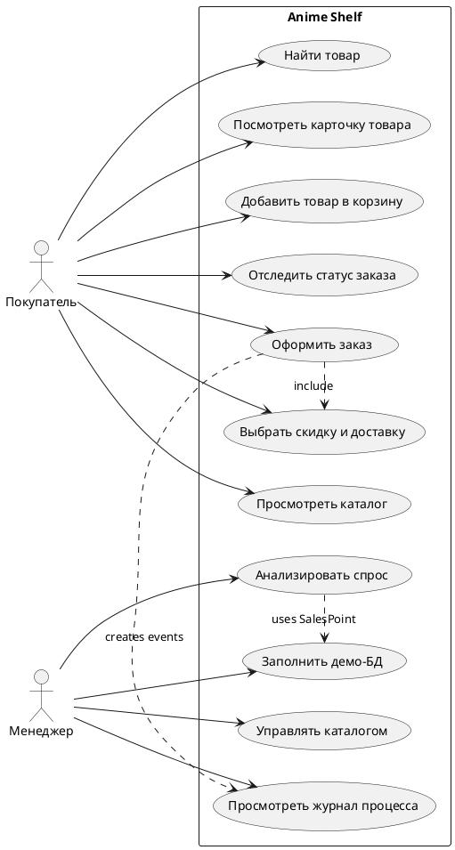

# Use Case

```plantuml
@startuml
left to right direction
actor "Покупатель" as Customer
actor "Менеджер" as Manager

rectangle "Anime Shelf" {
  usecase "Просмотреть каталог" as UC1
  usecase "Найти товар" as UC2
  usecase "Посмотреть карточку товара" as UC3
  usecase "Добавить товар в корзину" as UC4
  usecase "Выбрать скидку и доставку" as UC5
  usecase "Оформить заказ" as UC6
  usecase "Отследить статус заказа" as UC7
  usecase "Управлять каталогом" as UC8
  usecase "Заполнить демо-БД" as UC9
  usecase "Анализировать спрос" as UC10
  usecase "Просмотреть журнал процесса" as UC11
}

Customer --> UC1
Customer --> UC2
Customer --> UC3
Customer --> UC4
Customer --> UC5
Customer --> UC6
Customer --> UC7

Manager --> UC8
Manager --> UC9
Manager --> UC10
Manager --> UC11

UC6 .> UC5 : include
UC6 .> UC11 : creates events
UC10 .> UC9 : uses SalesPoint
@enduml
```

Ключевой сценарий: покупатель выбирает товары, оформляет заказ, система применяет стратегии цены и доставки, переводит заказ по состояниям и пишет события процесса.
